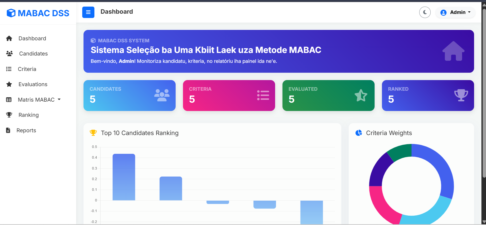

<div align="center">
  <h1>🌟 DSS MABAC</h1>
  <p><strong>A Professional Decision Support System utilizing the MABAC Method</strong></p>
</div>

## 📖 Overview

**DSS MABAC** is a robust, custom-built Decision Support System developed to solve complex multi-criteria decision-making problems. By employing the **Multi-Attributive Border Approximation area Comparison (MABAC)** method, this application provides accurate, data-driven insights to facilitate optimal decision-making processes.

Built on a lightweight, custom MVC (Model-View-Controller) PHP framework, the application ensures high performance, maintainability, and scalability.

## ✨ Key Features

- **Advanced Decision Logic:** Fully implements the MABAC algorithm for precise multi-criteria evaluation.
- **Custom MVC Architecture:** Clean separation of concerns with bespoke routing, controllers, models, and views.
- **Secure Authentication:** Integrated session-based user authentication and access control.
- **Dynamic Scaffolding:** Includes automated Python scripts for rapid code generation (Controllers, UI, REST APIs, and Core modules).
- **Responsive UI:** A modern, intuitive backend interface designed for seamless user experience.

## 📸 Screenshots

### Backend Dashboard


## 🚀 Tech Stack

- **Backend:** PHP (Native MVC)
- **Database:** MySQL / MariaDB
- **Automation/Scaffolding:** Python
- **Server Environment:** Apache / Nginx (XAMPP/MAMP compatible)

## ⚙️ Installation & Setup

Follow these steps to deploy the application locally:

1. **Clone the Repository**
   ```bash
   git clone https://github.com/yourusername/app-dss.git
   cd app-dss
   ```

2. **Database Configuration**
   - Create a new MySQL database named `dss_mabac_db`.
   - Import the provided SQL dump file: `dss_mabac_db.sql`.

3. **Environment Setup**
   - Open `config/app.php`.
   - Update the database credentials to match your local environment:
     ```php
     define('APP_URL', 'http://localhost/app-dss');
     define('DB_HOST', 'localhost');
     define('DB_USER', 'root');
     define('DB_PASS', '');
     define('DB_NAME', 'dss_mabac_db');
     ```

4. **Run the Application**
   - Move the project folder to your local server directory (e.g., `htdocs` for XAMPP).
   - Access the application via your web browser: `http://localhost/app-dss/public`

## 🛡️ License

This project is open-source and available under the [MIT License](LICENSE).

---
<div align="center">
  <i>Developed with precision and excellence.</i>
</div>
